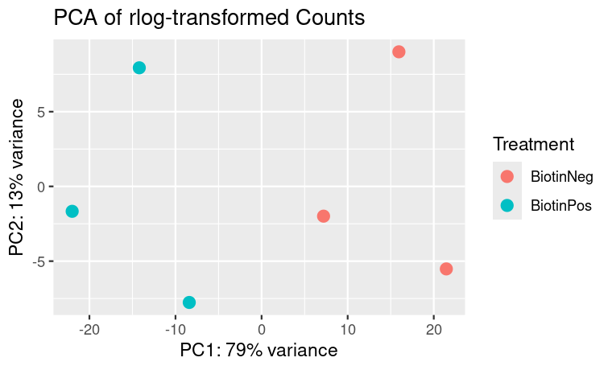
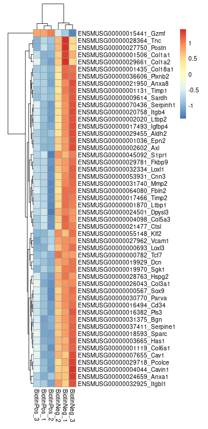
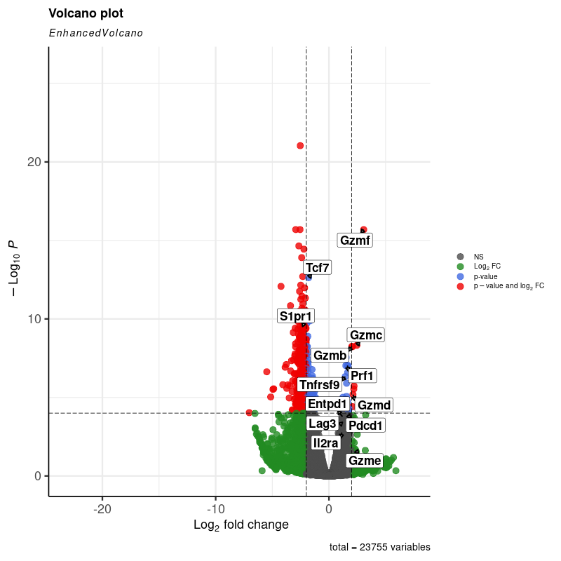
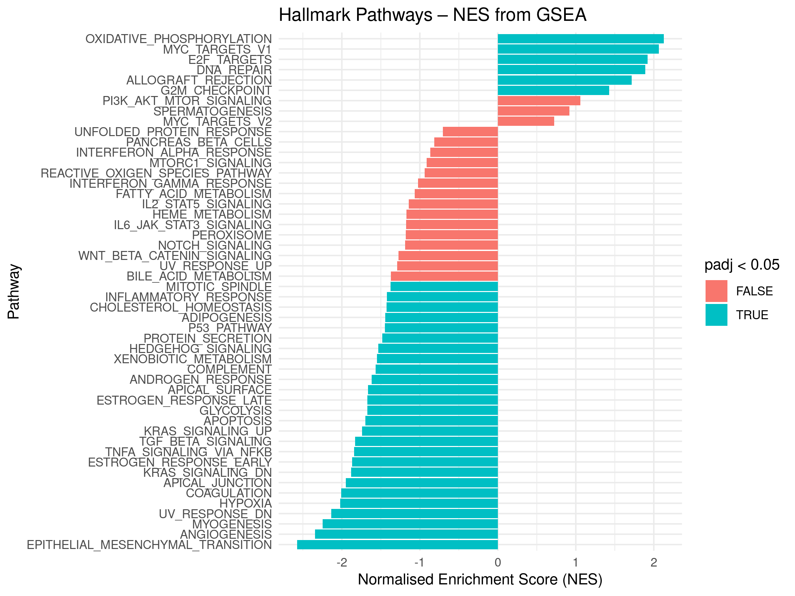

# RNA-Seq Analysis – GSE288148


## Description

This project is a complete RNA-seq analysis pipeline applied to the publicly available dataset [GSE288148](https://www.ncbi.nlm.nih.gov/geo/query/acc.cgi?acc=GSE288148), which explores tumour-immune interactions in *Mus musculus*. The dataset contains paired-end RNA-seq data from CD8+ T cells isolated from tumour-adjacent (Biotin+) and tumour-distal (Biotin−) tissues.

The pipeline begins with pre-aligned count data and performs:
- Sample metadata assignment from GEO
- Quality filtering and normalisation
- Differential gene expression analysis using `DESeq2`
- Gene annotation via `biomaRt`
- Functional enrichment via `fgsea` with Hallmark gene sets
- Visualisation: PCA, volcano plots, and heatmaps

## Table of Contents

- [Installation](#installation)  
- [Usage](#usage)  
- [Credits](#credits)
- [Features](#features)  
- [Reports](#reports)

## Installation

1. Clone the repository:

    ```bash
    git clone https://github.com/cemileblks/rna-seq-analysis
    cd rna-seq-analysis
    ```

2. Open `Analysis.Rmd` in RStudio.

3. Install required packages:

    ```r
    if (!requireNamespace("BiocManager", quietly = TRUE))
        install.packages("BiocManager")

    BiocManager::install(c("DESeq2", "fgsea", "biomaRt", "EnhancedVolcano", "pheatmap"))
    ```

4. Knit the `.Rmd` file to HTML or PDF to view the full analysis.

## Usage

This analysis begins with an R object containing **pre-aligned gene-level counts** (`mytable_features`). The dataset was aligned using STAR and the summary QC stats are available in the [MultiQC report (HTML)](reports/GSE288148_multiqc_report.html).

### Some of the plots generated by the analysis:

#### PCA of rlog-transformed expression:


#### Heatmap of top differentially expressed genes:


#### Volcano plot of DE genes (highlighting paper-reported genes):


#### GSEA NES barplot:


📄 Complete report with explanations: [Analysis_Report.pdf](reports/GSE288148_analysis_report.pdf)

## Credits

- **Author**: [cemileblks](https://github.com/cemileblks)
- RNA-seq analysis adapted from coursework in the *Functional Genomic Technologies* course at the University of Edinburgh.
- [GSE288148 dataset](https://www.ncbi.nlm.nih.gov/geo/query/acc.cgi?acc=GSE288148) – Lou et al., 2025
- Visualisation and methods adapted from Bioconductor documentation and:
  - https://bioconductor.org/packages/release/bioc/html/DESeq2.html
  - https://stephenturner.github.io/deseq-to-fgsea/

## Features

- 🔬 Complete RNA-seq analysis from preprocessed counts
- 📊 Visualisation of PCA, DE genes, and pathway enrichment
- 💡 Interpretation of biological significance using GSEA
- 👩‍💻 Code that can be adapted to new GEO datasets
- 🎯 Differential expression: DESeq2 with padj < 0.05, ranked by absolute Wald test statistic  

## Reports

- [Analysis Report (PDF)](reports/GSE288148_analysis_report.pdf)  
- [MultiQC Report](reports/GSE288148_multiqc_report.html)
